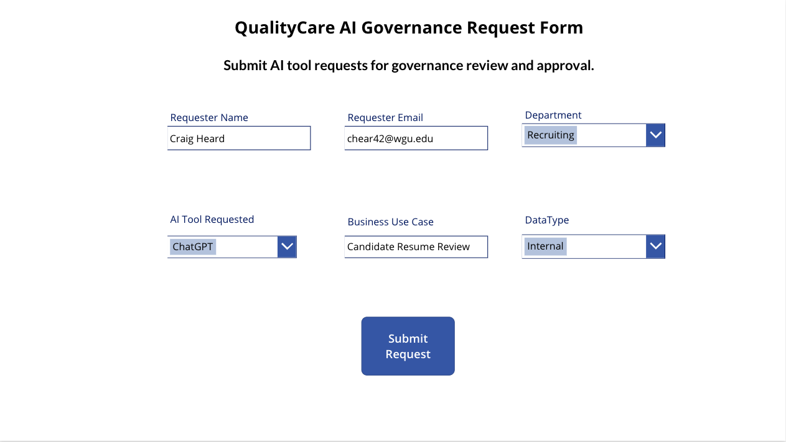
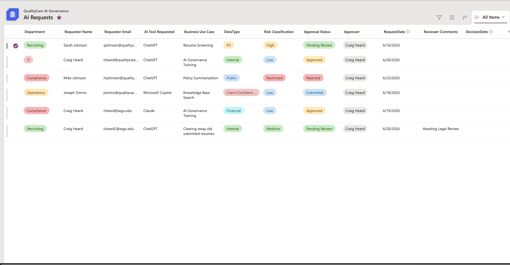
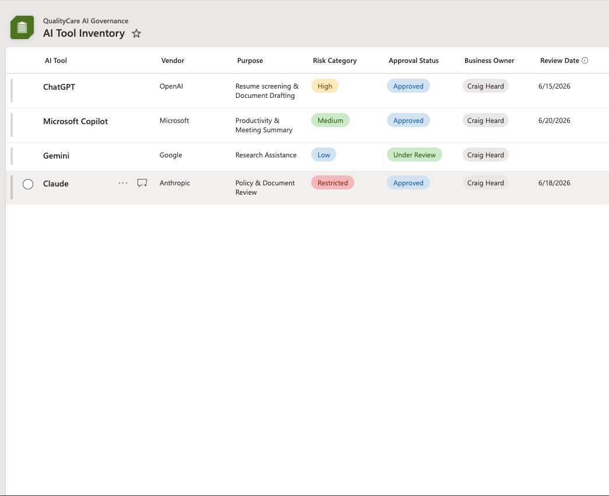
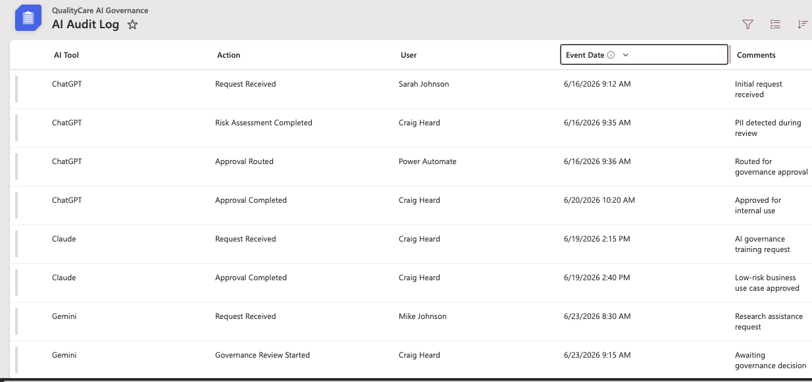
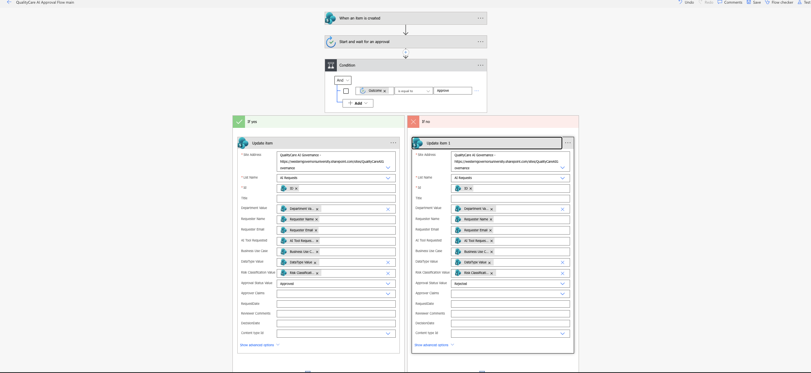
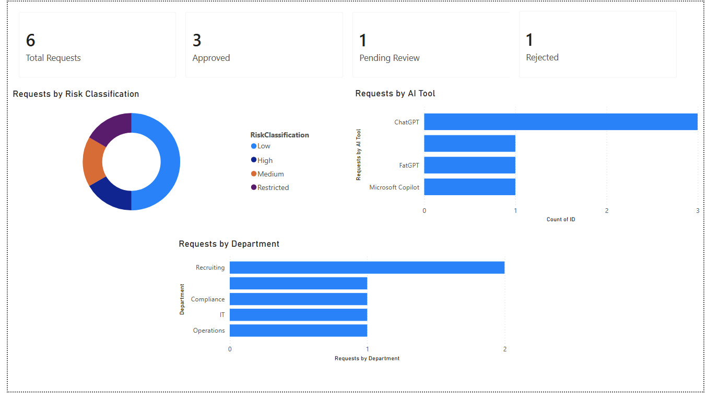

# QualityCare AI Governance Platform

**Author:** Craig W. Heard, MBA

---

# Project Overview

The QualityCare AI Governance Platform is an end-to-end Governance, Risk Management, and Compliance (GRC) portfolio project demonstrating how organizations can establish responsible AI governance using Microsoft Power Platform.

Rather than focusing solely on technology, this project emphasizes governance design, organizational risk management, executive oversight, business process improvement, and workflow automation. It demonstrates how governance principles can be translated into operational workflows supporting responsible AI adoption within a healthcare environment.

The project combines Governance, Risk & Compliance (GRC), Identity & Access Management (IAM), AI Governance, IT Management, and Microsoft Power Platform into a practical enterprise governance solution.

---

# Business Problem

Organizations are rapidly adopting Artificial Intelligence technologies, often without formal governance, risk assessment, approval processes, or executive oversight.

QualityCare Healthcare required a structured governance framework capable of:

- Managing AI tool requests
- Assessing organizational risk
- Classifying organizational data
- Establishing approval workflows
- Maintaining audit evidence
- Providing executive reporting
- Supporting compliance and governance activities

---

# Project Objectives

The project was designed to:

- Establish an AI Governance Program
- Develop an organizational AI Risk Register
- Design an AI Governance Control Framework
- Automate governance workflows
- Centralize AI governance records
- Provide executive dashboards
- Demonstrate governance automation using Microsoft Power Platform

---

# Governance Framework

This project includes:

- AI Governance Framework
- AI Risk Register
- Governance Control Framework
- Data Classification Model
- Approval Matrix
- AI Tool Inventory
- Audit Logging Framework
- Executive Reporting Framework

---

# Governance Workflow

The governance lifecycle follows a structured process:

Employee Request

↓

Risk Classification

↓

Governance Review

↓

Approval Decision

↓

Audit Logging

↓

Executive Reporting

↓

Continuous Governance Monitoring

---

# Technology Platform

The governance platform was implemented using:

- Microsoft Power Apps
- Microsoft SharePoint Lists
- Microsoft Power Automate
- Microsoft Power BI
- Microsoft 365

These technologies automate governance activities while providing centralized reporting and executive visibility.

---

# Project Components

## AI Request Intake

Power Apps provides a structured intake process allowing employees to submit AI tool requests while capturing governance information including:

- Requester
- Department
- Business Use Case
- Requested AI Tool
- Data Classification
- Risk Classification

---

---

# Project Screenshots

## 1. AI Request Form

## 2. AI Requests

## 3. AI Tool Inventory

---

## 4. AI Audit Log

---

## 5. Power Automate Approval Flow

---

## 6. Executive Dashboard

SharePoint Lists provide centralized governance data supporting:

- AI Requests
- AI Tool Inventory
- Audit Log

---

## Executive Reporting

Power BI provides executive visibility into:

- AI adoption
- Risk exposure
- Department usage
- Approval activity
- Governance compliance
- Organizational AI trends

---

# Skills Demonstrated

## Governance, Risk & Compliance (GRC)

- Governance framework development
- Risk management
- Enterprise risk management
- Risk identification
- Risk assessment
- Control design
- Control mapping
- Compliance reporting
- Audit readiness
- Executive reporting
- Governance documentation

---

## Identity & Access Management (IAM)

This project applies Identity Governance concepts including:

- Identity Governance
- Role-Based Access Control (RBAC)
- Governance approval workflows
- Separation of Duties (SoD)
- Least Privilege concepts
- Access governance lifecycle management
- Governance automation

---

## AI Governance

- AI Governance Framework development
- AI Risk Register design
- AI Governance Control Framework
- Responsible AI governance
- AI approval workflows
- AI inventory management
- AI governance reporting

---

## Risk Management

- Enterprise risk identification
- Risk classification
- Risk assessment
- Risk prioritization
- Governance decision support
- Continuous monitoring

---

## NIST AI Risk Management Framework (AI RMF)

The governance concepts demonstrated throughout this project align with principles of the NIST AI Risk Management Framework (AI RMF), including:

- GOVERN
- MAP
- MEASURE
- MANAGE

---

## MBA – IT Management Concepts Applied

This project incorporates business and management concepts including:

- IT Governance
- Business Process Improvement
- Enterprise Risk Management
- Organizational Change Management
- Strategic Planning
- IT Project Management
- Data-Driven Decision Making
- Executive Decision Support
- Governance Program Development

---

## Microsoft Power Platform

- Power Apps
- Power Automate
- SharePoint Lists
- Power BI
- Microsoft 365

---

# Future Enhancements

Future project phases may include:

- Automated AI risk scoring
- Multi-stage governance approvals
- Policy acknowledgement workflows
- Vendor AI risk assessments
- AI governance maturity scoring
- Enhanced executive analytics
- AI governance scorecards
- Microsoft Purview integration
- Microsoft Defender integration

---

# Portfolio Purpose

This portfolio project demonstrates the integration of:

- Governance, Risk & Compliance (GRC)
- Identity & Access Management (IAM)
- AI Governance
- Enterprise Risk Management
- NIST AI Risk Management Framework concepts
- MBA IT Management principles
- Microsoft Power Platform

into a practical enterprise governance solution.

While designed around a fictional healthcare organization, the governance principles, workflows, controls, automation, and reporting model are applicable across healthcare, finance, government, and other regulated industries.

---

# Author

**Craig W. Heard, MBA**

Healthcare IT • AI Governance • Governance, Risk & Compliance (GRC) • Identity & Access Management (IAM) • Risk Management • Microsoft Power Platform • Executive Reporting
